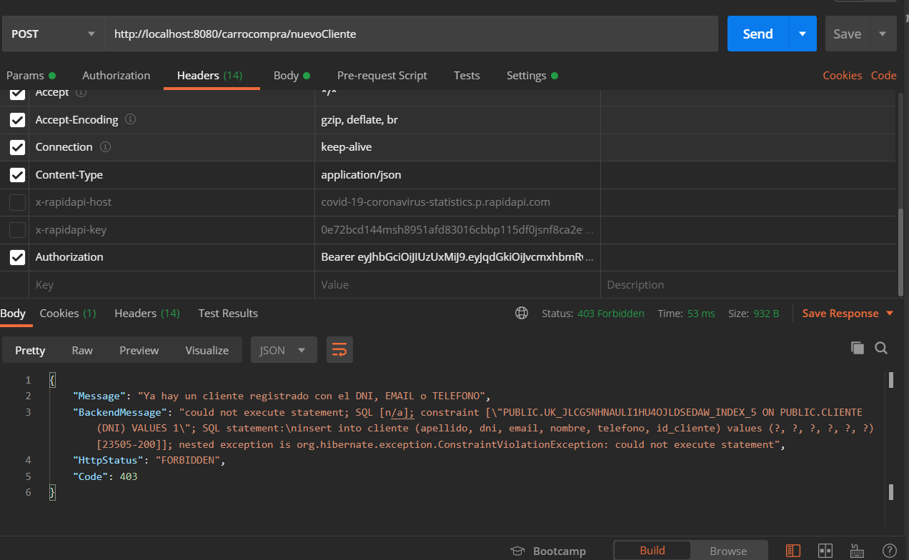
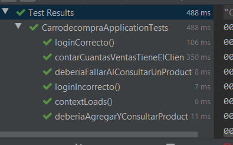

# ZemsaniaPruebaTecnica 

## Evidencias

Prueba del mensaje de error en formato JSON

Pruebas exitosas

## Respuestas a preguntas realizadas

Con sus propias palabras indique de qué forma podría mejorar la seguridad y optimizar el carrito de compras.

**R:/** Para mejorar la seguridad de la aplicación realizaría una validación en el CRUD Productos ya que con la implementación y diseño actual cualquier usuario puede borrar o actualizar Productos de otros usuarios lo que termina en una falla de confiencialidad bastante grave, un ejemplo es cambiar el precio de un producto a uno más económico

Para optimizar un poco el desempeño en la tabla de Cliente agregaría el username y el password del usuario así tener un poco mejor organizado los datos, con esto también lograría automatizar algunas tareas ya que al tener los datos de autorización dentro de esta podría obtener rapidamente el ID del usuario gracias al UserDetails, esto permitirá primero poder prohibirle a un usuario cambiarle información sobre otro ya que para poder encontrar el Cliente para asignarle una venta me tienen que envíar el DNI del cliente por medio del Path lo cual da a lugar a grandes brechas de seguridad

Otro aspecto a considerar es la tabla de DetallesVenta ya que se puede quitar esa tabla dejando una relación muchos a muchos entre Producto y Venta (Esto se puede ya que en DetalleVenta no se almacena más información que el idProducto y el idVenta [no menciono idDetalleVenta ya que la nueva FK podría ser el conjunto de estos anteriores])

## Dockerfile

Para el Dockerfile quiero agregar que por cuestiones tecnicas de mi computador no logro instalar el motor de Docker por ende en la misma imagen clono el repositorio ya que considero que es una manera fácil de pasarse el repositorio a una instancia de MV en la nube (fue probado en AWS usando AWS Linux)
